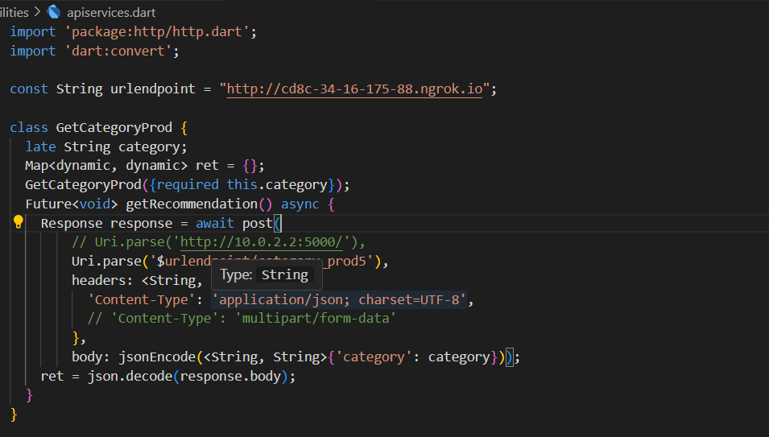
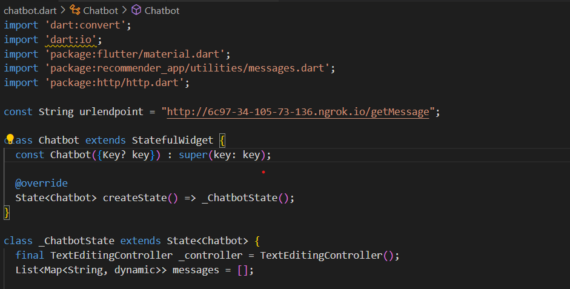
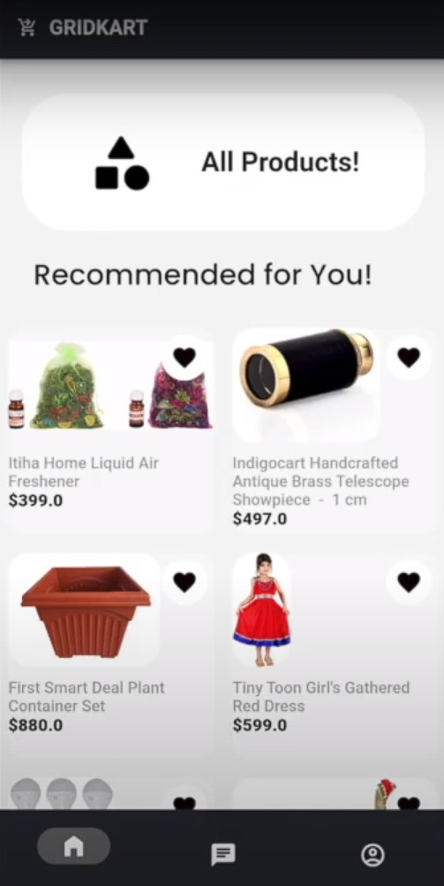
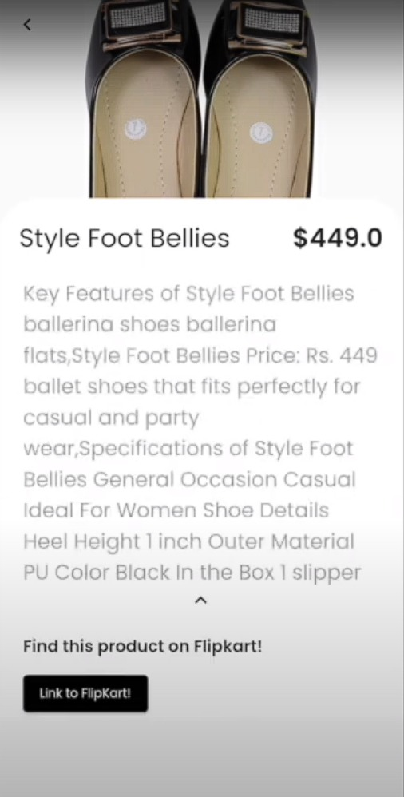
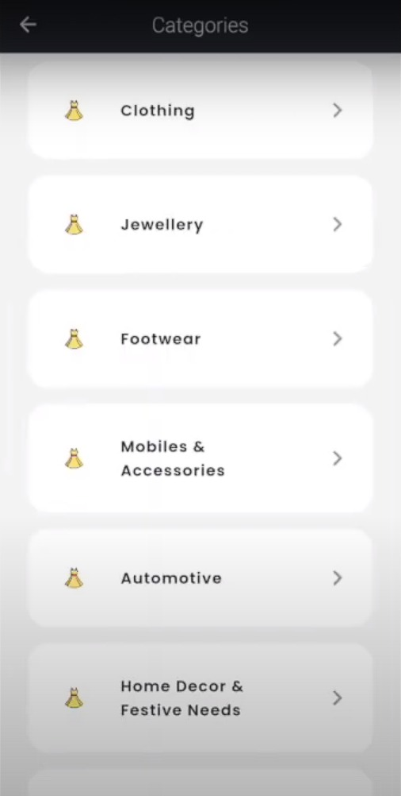
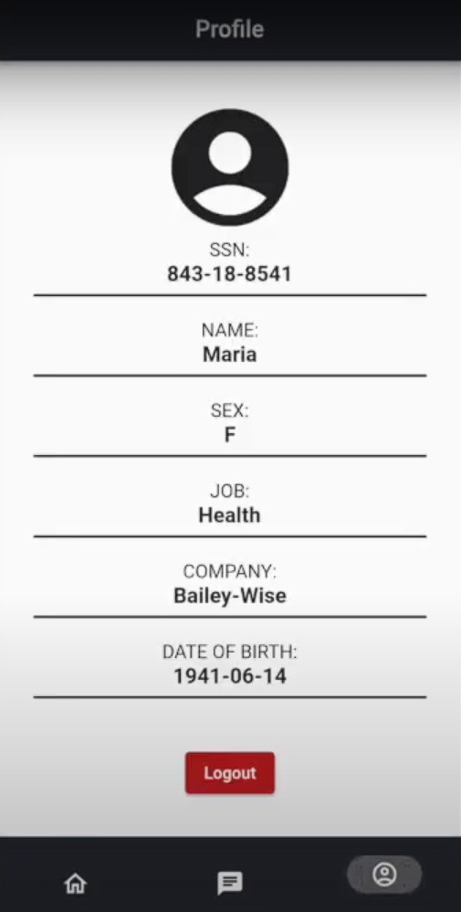

Instructions:

You can access our youtube video here :

You can access our complete project on github here : https://github.com/NamanSN240002/FKG-Software-AAPlus

After running the app.run() in both collab notebooks, please paste the ngrok tunneling link in the variable urlendpoint of the pages chatbot.dart and apiservices.dart of the application.

# GridKart

## Problem Statement :

The aim is to enhance user experience by implementing a personalized product ranking system.
Your task is to develop an algorithm or model that can generate accurate and relevant product
rankings for individual users. The ranking system should consider factors such as user
preferences, past interactions, product popularity, and user similarity. It should be able to predict
the most suitable products for a user based on their unique characteristics and preferences.

## Dataset :

The dataset is taken from the official scraped flipkart product dataset. You can download the dataset from [here](https://www.kaggle.com/datasets/PromptCloudHQ/flipkart-products))

## Approach :

The problem statement can be broken down into the following sub-problems:

**Acquiring product, user and rating dataset:**

    1)We acquired product dataset from kaggle (https://www.kaggle.com/datasets/PromptCloudHQ/flipkart-products)

    2) We generated user and user ratings dataset using faker

    3)The ratings data is used to find the preference and purchase history of users

**Creating user profiles based on preference and interactions:**

    1) We generated user and user ratings dataset using faker
    2)The ratings data is used to find the preference and purchase history of users

**Giving recommendation to user based on purchase history and user similarity:**

    1) We use the concept of collaborative filtering to find user similarity
 	2) We generate cosine similarity between users and recommend top products based on it.

**Providing a personalized recommendation:**

    1) We use the power of LLM to create a chatbot that can talk with the user and generate recommendation by interacting with the user.
    2) The LLM powered chatbot is able to find user preference and then recommend products from our dataset through embedding and similarity search.

&nbsp;

## Installation

To run our code:

1. Clone the repository
   ``git clone https://github.com/NamanSN240002/FKG-Software-AAPlus.git``
2. Install the flutter dependencies
   ``flutter pub get``
3. Run both the ipynb files under ML_Models folder to initiate the backend pyhton server.
4. Copy the code from the ngrok tunneling link and paste it in the variable urlendpoint of the pages chatbot.dart and apiservices.dart of the application.

These are the screeenshots for the url endpoint variable in the dart files :

lib/utilities/apiservices.dart    --->

lib/chatbot.dart    --->

## App Inerface :

## Libraries used :
    1) Pandas
    2) Numpy
    3) Matplotlib, Seaborn, Plotly
    4) Scikit-Learn
    5) Flask
    6) Folium
    7) Statsmodels
    8) Faker
    9) Langchain

## Technical Aspects :

    1) Python
    2) Jupyter Notebooks
    3) Front-end : Flutter
    4) Back-end : Flask
    5) Machine Learning : Collaborative Filtering, Cosine Similarity, Large Language Model(Falcon)

## Team Members :

    1) Naman Singh Nayal
    2) Aaryan Gupta

## Authors and Acknowledgement

#### **Aaryan Gupta**

[LinkedIn 👔](https://www.linkedin.com/in/aaryan-gupta-a881661b8/)
[Github 💾](https://github.com/Aaryan0424)

#### **Naman Singh Nayal**

[LinkedIn 👔](https://www.linkedin.com/in/naman-singh-nayal-8364b5202/)
[Github 💾](https://github.com/NamanSN240002)

&nbsp;

## Demo Link

A demo video can be found [here](https://youtu.be/2_ysbhiQd58)

## License

[MIT](https://choosealicense.com/licenses/mit/)
